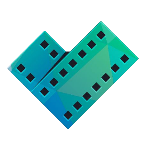

# Popular Movies

This is the repository for the movie app that build during the [Developing Android Apps](https://www.udacity.com/course/new-android-fundamentals--ud851) course at Udacity.

 

## How to use
To use the app, you need create 'movie_api.properties' outside the project directory. Then, in the properties file, you must specify an API_KEY:

apiKey=YOUR_API_KEY

(Not recommended) You can specify an API_KEY directly in '/app/build.gradle':

buildConfigField('String', 'API_KEY', '"YOUR_API_KEY"')

## Libraries and tools used in the project

### Android

* [Android Support Library](https://developer.android.com/topic/libraries/support-library/index.html)
Provides additional convenience classes and features not available in the standard Framework API for easier development and support across more devices.

### Architecture and Design

* [Android Architecture Components](https://developer.android.com/topic/libraries/architecture/index.html)
A collection of libraries that help you design robust, testable, and maintainable apps.
Start with classes for managing your UI component lifecycle and handling data persistence.

### View and Image

* [ConstraintLayout](https://developer.android.com/training/constraint-layout/index.html)
Allows you to create large and complex layouts with a flat view hierarchy (no nested view groups).
* [CoordinatorLayout](https://developer.android.com/reference/android/support/design/widget/CoordinatorLayout.html)
CoordinatorLayout is a super-powered FrameLayout.
* [RecyclerView](http://developer.android.com/reference/android/support/v7/widget/RecyclerView.html)
A flexible view for providing a limited window into a large data set.
* [CardView](https://developer.android.com/reference/android/support/v7/widget/CardView.html)
A FrameLayout with a rounded corner background and shadow.
* [Picasso](http://square.github.io/picasso/)
An image loading and caching library for Android.

### Data Request

* [Retrofit](http://square.github.io/retrofit/)
A type-safe HTTP client for Android and Java.
* [OkHttp](http://square.github.io/okhttp/)
An HTTP & HTTP/2 client for Android and Java applications.

### Persistence

* [ContentProvider](https://developer.android.com/topic/libraries/architecture/room.html)
The favorite movies are stored in a native SQLite database and are exposed via a ContentProvider. This ContentProvider is updated whenever the user favorites or unfavorites a movie.

### Debugging and tests

* [Stetho](https://developer.android.com/reference/android/content/ContentProvider.html)
A debug bridge for Android applications.

## Logo
Logo taken from [Freepik](https://www.freepik.com/free-vector/camera-logos-in-green-and-blue-color_831257.htm).

## License

    Copyright (C) 2018 The Android Open Source Project
    
    Licensed under the Apache License, Version 2.0 (the "License");
    you may not use this file except in compliance with the License.
    You may obtain a copy of the License at
    
        http://www.apache.org/licenses/LICENSE-2.0
    
    Unless required by applicable law or agreed to in writing, software
    distributed under the License is distributed on an "AS IS" BASIS,
    WITHOUT WARRANTIES OR CONDITIONS OF ANY KIND, either express or implied.
    See the License for the specific language governing permissions and
    limitations under the License.